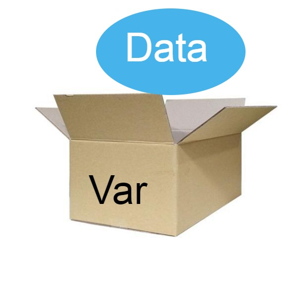

# 2강 변수와 자료형 1편
이번 강의에서는 파이썬의 기본 자료형 (int, str, bool, float, bytes)과 변수에 대해서 알아보려고 해요.

## 변수란 무엇인가?
파이썬을 포함한 대부분의 프로그래밍 언어에는 **변수**라는 개념이 존재합니다. 변수란, 데이터를 담는 상자와 같은 개념이에요.


프로그래밍을 할 때, 여러 변수에 필요한 데이터를 저장해두고 사용하게 될 거에요.
파이썬에서 변수를 사용하려면 아래의 코드처럼 작성하면 되요.
```python
a = 0
b = "Hello World"
c = True
```

## 자료형(타입) 이란 무엇인가?
변수에 데이터를 할당할 때, 여러 종류의 데이터를 할당할 수 있어요.
> 정수형 데이터 : int
정수형 데이터는, 정수 범위의 데이터를 말해요.
프로그래밍 언어에서는 일반적으로 소수점이 없는 수들이 해당해요.
```python
var = 8
```
> 실수형 데이터 : float
실수형 데이터는 실수 범위의 수 데이터를 말해요.
프로그래밍 언어에서는 일반적으로 소수점을 포함하는 수들을 말해요.
float 타입으로 표현하는 실수 정보는 완벽하지 않아요. 보다 자세한 이야기는 나중에 **부동소수점** 에 대한 강의에서 다뤄볼게요.
```python
var = 3.14
```
> 문자열 데이터 : str
문자열 데이터는, 말 그대로 여러개의 문자들이 담긴 데이터를 말해요. 여러분들이 인터넷에서 보는 각종 글이나, 카카오톡 등으로 대화할 때 보내는 메세지 같은걸 생각하시면 되요.
파이썬에서 문자열 데이터를 사용하려면, "" (큰 따옴표) 또는 '' (작은 따옴표) 로 감싸서 사용해요.
```python
var = "문자열이에요!"
```
> 진리 데이터 : bool
진리 데이터는, 참 또는 거짓의 값을 가지는 자료형이에요.
파이썬에서는 참 값은 True, 거짓 값은 False로 사용해요.
```python
var = True
```

[예제 코드](/Basics/02%20-%20변수와%20기본%20자료형/var_and_basic_types.py)
[이전 강좌](/Basics/01%20-%20파이썬%20설치/README.md)
[다음 강좌](/Basics/03%20-%20기본%20입출력%20함수/README.md)