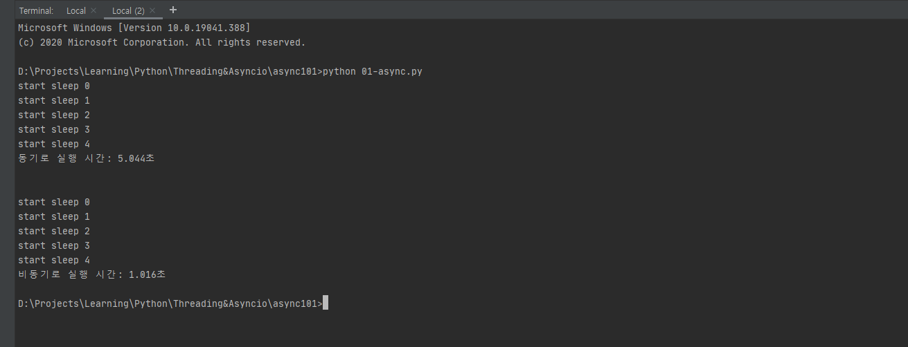

# 3강 기본 입출력 함수
이번 강의에서는 파이썬의 기본 입출력 함수에 대해 이야기해보려고 합니다.

## 입출력이란 무엇인가?
입출력이란, 말 그대로 입력과 출력이에요. 프로그래밍을 하면서, 만들어낸 프로그램이 외부로부터 데이터를 **입력** 받고, 프로그램이 외부에 데이터를 **출력** 하게 될거에요.
이 입력과 출력은 프로그램이 실행중인 콘솔에서 이루어질 수도 있고, 프로그램과 통신하는 외부 서버 사이에서 이루어질 수도 있습니다.

오늘은, 가장 기본적인 콘솔과의 입출력에 대해 배워보려고 해요.

## 콘솔이란 무엇인가?

프로그램을 실행할 때, 검정색 배경에 흰색으로 글씨가 적혀있는 창이 나타날거에요. 이 창을 **콘솔(console)** 이라고 불러요.
우리는 이 창에 데이터를 출력할 수도 있고, 반대로 이 창에서 프로그램으로 데이터를 입력할 수도 있어요.

우선, 이 창에 데이터를 입력하는 과정부터 진행해볼게요.
파이썬에서는 콘솔에 데이터를 출력하는 가장 기본적인 함수로 **print** 를 제공해요.
이 print 함수의 괄호 안에 출력하고자 하는 데이터를 전달해, 콘솔에 데이터를 출력할 수 있어요.
[ code ]
```python
print(100)
print(True)
print("Hello World!")
print(3.14)
```
[ result ]
```
100
True
Hello World!
3.14
```
print 함수에 여러개의 데이터를 쉼표(,) 로 구분해서 입력해주면, 입력한 데이터들을 공백 한 칸(띄어쓰기)으로 구분해서 출력해줘요.
[ code ]
```python
print(100, True, "Hello!", 3.14)
```
[ result ]
```
100 True Hello! 3.14
```

앞서 2강에서 여러가지 자료형의 데이터들을 변수에 저장했었죠? 파이썬에서는 변수가 담고있는 데이터의 자료형을 반환하는 **type** 이라는 함수가 있어요.
[ code ]
```python
print(type(100))
print(type(True))
print(type("Hello World!"))
print(type(3.14))
``` 
[ result ]
```
<class 'int'>
<class 'bool'>
<class 'str'>
<class 'float'>
```

위에서 살펴 보았듯 print에 print("Hello world!")와 같은 단순한 문장이 아니라 변수 여러개, 혹은 변수와 문자열이 혼합되어 있는 상태로 출력할 수도 있어요.
이럴때 데이터들 간 공백을 집어 넣어서 출력하고 싶기도 하겠지만 특정한 문자나 혹은 다 붙여서 출력하고 싶을 경우가 있을거에요.
파이썬은 **end**와 **sep**이라는 인자를 통해서 이를 조절할 수 있는 방법을 제공해요.

end는 print문 안에 있는 데이터들을 모두 출력 한 후 마지막에 어떤 문자를 출력할 지 결정하고,
sep은 print문 안에 있는 데이터 사이 사이에 어떤 문자를 넣을지 결정하는 인자에요.

end의 기본값은 "\n"(얘는 엔터와 같다고 생각하면 돼요),
sep의 기본값은 " "(한 칸 띄어쓰는 거에요)입니다.

따라서 우리가 아래의 코드를 실행시키면 자동적으로 print 함수 1개를 실행시킬 때마다 엔터가 삽입되고, 데이터 사이 사이에 띄어쓰기가 자동적으로 적용되는거에요.

end와 sep 설정을 변경하기 위해서는 아래와 같이 하면 돼요.

print([데이터], end="", sep="")

여담으로, end와 sep의 순서는 관계 없어요. 그러면 코드를 통해서 어떻게 실행되는지 알아보도록 할게요.

[ code ]
```python
print("H", "e", "l", "l", "o", sep="", end=" ")
print("Python!")
```

[ result ]
```
Hello Python
```

위에서 보았던 것과는 대조적이죠? 첫 번째 print 함수에서는 각 데이터들 간에 띄어쓰기가 적용되지 않았고 마지막에 한 줄 내려가는 대신 띄어쓰기 한 칸이 적용되었어요.
그리고 두 번째 print 함수의 데이터가 이어져서 출력되었고요.

콘솔에 데이터를 출력했다면, 이제는 콘솔에서 데이터를 입력할 차례겠죠.
파이썬은 콘솔에서 데이터를 입력받는 가장 기본적인 함수로 **input**을 제공해요.
이 input 함수의 괄호 안에는 데이터 입력을 받기 전에 출력할 문자열을 전달하고, input 함수는 입력받은 데이터를 문자열로 반환해요.
[ code ]
```python
answer = input("정답을 입력해주세요! : ")
print("입력하신 정답은", answer, "입니다.")
```
[ resuit]
```
정답을 입력해주세요! : 안녕
입력하신 정답은 안녕 입니다.
```
***

[예제 코드 보기](./builtin_IOs.py)

[<- 이전 강좌](../Basics/02-variables_and_types/README.md) /
[다음 강좌 ->](../04-operators/README.md)

